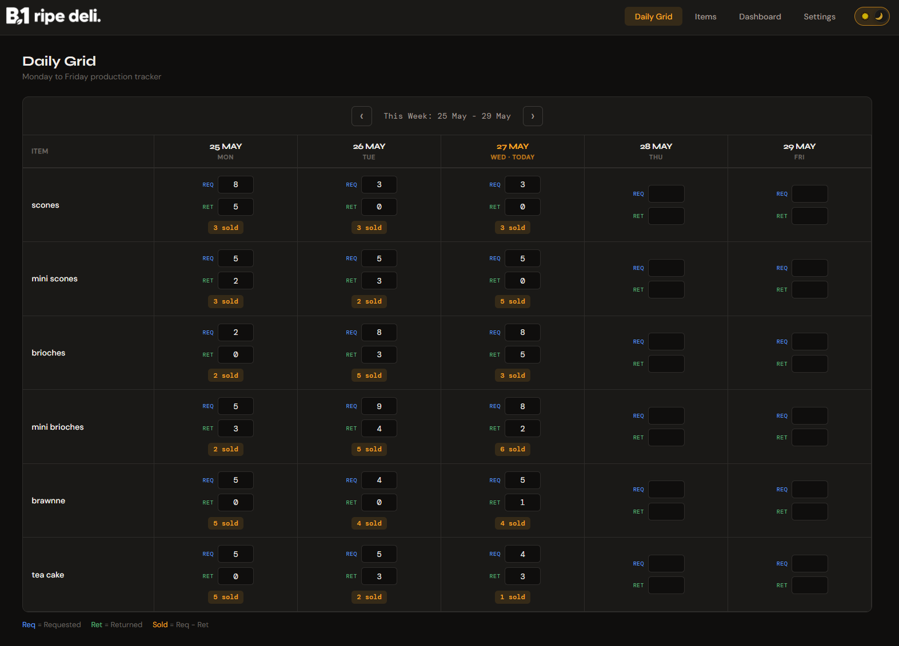
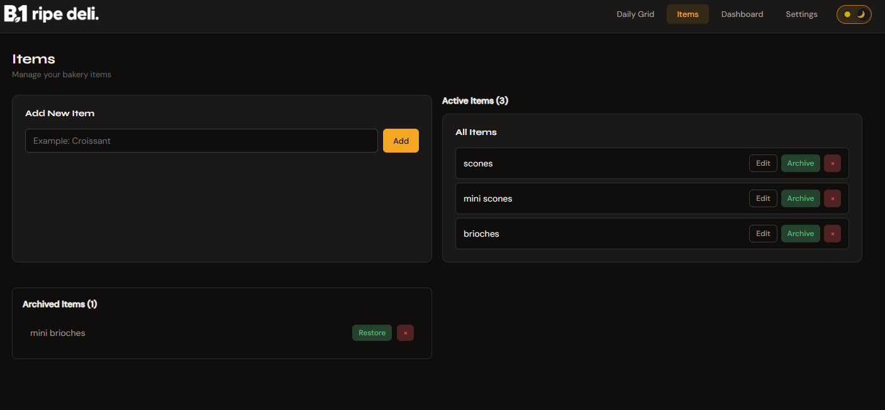
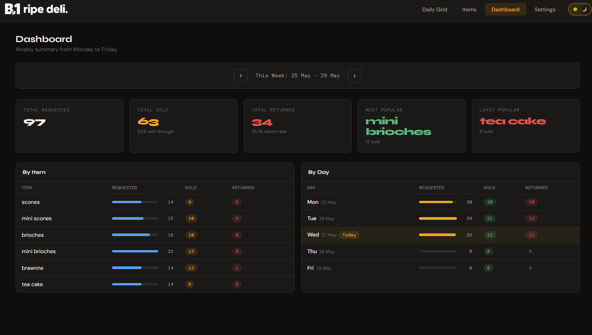
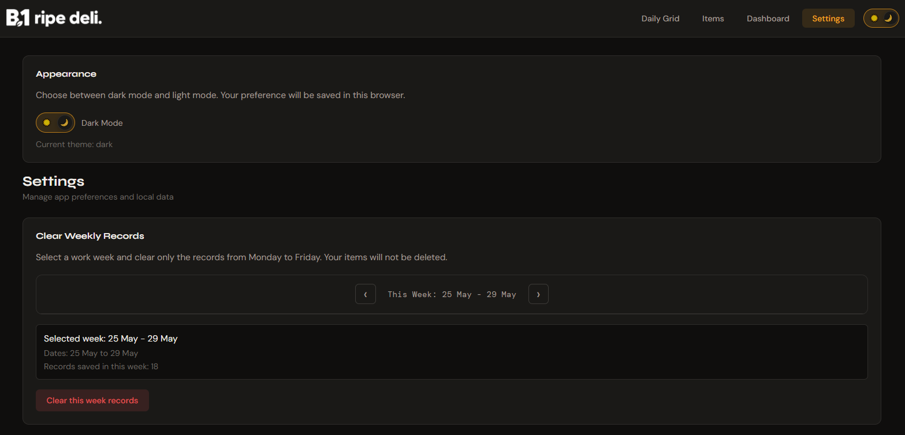

# B1 Ripe Deli Daily Tracker

A React application for tracking daily product requests, returns, and sales in a food production workflow. Built as a portfolio project to practice frontend development skills.

## Live Demo

[View Live Demo](https://b1-daily-tracker.vercel.app)

## Screenshots

### Daily Grid



### Items



### Dashboard



### Settings



## Project Overview

This app helps deli and food production staff track daily product movement from Monday to Friday. It answers questions like:

- How many items were requested each day?
- How many items were returned?
- How many items were sold?
- Which products are most popular?
- Which products need quantity adjustments?

## Features

- **Daily Grid**: Enter requested and returned quantities for each product, Monday–Friday
- **Automatic Calculations**: Sold quantity = Requested − Returned
- **Week Navigation**: Move between weeks with Previous, Next, and Current Week buttons
- **Item Management**: Add, edit, archive, restore, and permanently delete products with confirmation dialogs
- **Dashboard Analytics**:
  - Total requested, returned, and sold quantities
  - Return rate percentage
  - Most and least popular products
- **Input Validation**:
  - Returned quantity cannot exceed requested quantity
  - Quantity inputs accept non-negative whole numbers from 0 to 9999
  - Item names limited to 40 characters
  - Real-time error feedback with red highlighting
  - Returns focus to invalid fields for correction
- **Responsive Design**: Works on mobile, tablet, and desktop
- **Theme Support**: Light and dark modes with persistent preference
- **Theme-Aware Branding**: Logo changes based on selected theme
- **Notifications**: Toast alerts via Sonner for user feedback
- **Local Data Persistence**: All records saved in browser `localStorage`
- **Demo Data**: Automatically loads on first launch with realistic sample data

## Tech Stack

- **React** 19.2.6
- **React Router DOM** 7.15.1
- **Vite** 8.1.5
- **Sonner** 2.0.7 (toast notifications)
- **JavaScript** (no TypeScript yet)
- **CSS** (vanilla, with CSS variables for theming)

## How It Works

### Weekly Tracking

The app organizes records by week (Monday–Friday). Each record consists of:
- **Product/Item**: The specific product being tracked
- **Date**: The workday (Monday–Friday only)
- **Requested**: Quantity delivered to the store
- **Returned**: Quantity not sold (marked for return)
- **Sold**: Automatically calculated as `Requested − Returned`

### Data Storage

All data is stored in the browser's `localStorage`. Each record is uniquely identified by:
- **Item ID**
- **Date** (YYYY-MM-DD format)

This means:
- Data persists across browser refreshes
- Data is local to the current browser only
- Clearing browser storage clears all records
- No backend server or database is required for this project

### Demo Data

On first launch, the app generates realistic demo data:

```
Product: Scone
Requested: 11 (delivered to store)
Returned: 1 (not sold)
Sold: 10 (calculated automatically)
```

**Demo Coverage:**
- **7 Products**: Scone, Mini Scone, Brioche, Mini Brioche, Savoury Brioche, Key Lime, Cookies
- **Rolling Period**: Approximately one month of weekday records (from one month ago through today)
- **Records**: One record per product per workday in that period

**Demo Behavior:**
- Generates only once per browser/device
- Does not generate records for future dates
- Current week includes data only through today
- Becomes your working data after first launch

### Validation

To verify demo data integrity, run:

```bash
npm run validate:demo
```

This checks:
- Product definitions (7 items)
- Record counts and date ranges
- Quantity validation (Returned ≤ Requested)
- Workday-only records
- Deterministic generation

## Project Structure

```
src/
├── App.jsx                    # Main app component with routing
├── main.jsx                   # React entry point
├── index.css                  # Global styles and theme variables
├── components/
│   └── layout/                # Navigation and page layout
├── context/                   # React context (theme)
├── dashboard/                 # Dashboard stats and tables
├── grid/                      # Daily Grid component
├── hooks/                     # Custom React hooks
├── items/                     # Item management components
├── pages/                     # Page components (routed)
├── constants/                 # App-wide constants
└── utils/                     # Helper functions and validation
```

## Pages

### Daily Grid (`/daily-grid`)

Enter and edit product quantities for the selected week. Each product row shows:
- Requested quantity input
- Returned quantity input
- Automatically calculated sold quantity
- Visual feedback for validation errors

**Week Navigation:**
- Previous Week: Go back one week
- Next Week: Go forward one week
- This Week: Jump to the current week

### Items (`/items`)

Manage your product list:
- **Add**: Create a new product
- **Edit**: Rename a product
- **Archive**: Hide a product from future data entry while preserving all historical records and Dashboard statistics (can be restored later)
- **Restore**: Bring an archived product back to active use
- **Permanently Delete**: Remove a product entirely, including all associated historical records (cannot be undone)

Archive is useful when you want to stop using a product without losing its history. Permanent Delete removes both the product and its records completely.

### Dashboard (`/dashboard`)

Analyze the currently selected week:
- **Summary**: Total requested, returned, sold, and return rate (%)
- **Most Popular**: Product with the highest sales
- **Least Popular**: Product with the lowest sales
- **Top Products**: Ranked by quantity sold

### Settings (`/settings`)

App preferences and data management:
- **Theme Switcher**: Toggle between light and dark modes
- **Clear Weekly Records**: Remove all records from the selected week
- **Note**: No "Reset All Data" option to protect important records

## Getting Started

### Installation

```bash
git clone <repository-url>
cd <project-folder>
npm install
```

### Development

```bash
npm run dev
```

Starts a local dev server (usually http://localhost:5173).

### Production Build

```bash
npm run build
```

Creates optimized files in the `dist/` folder.

### Preview Production Build

```bash
npm run preview
```

Test the production build locally.

### Code Quality

```bash
npm run lint
```

Checks code for style and potential errors using ESLint.

### Validate Demo Data

```bash
npm run validate:demo
```

Verifies demo data generation, integrity, and deterministic behavior.

## Deployment

This project is deployed on **Vercel** at [b1-daily-tracker.vercel.app](https://b1-daily-tracker.vercel.app).

### Vercel Configuration

The project includes a `vercel.json` file that configures client-side routing:

```json
{
  "rewrites": [
    {
      "source": "/(.*)",
      "destination": "/"
    }
  ]
}
```

This ensures that navigating to nested routes (like `/dashboard` or `/items`) works correctly when refreshing the page.

### Local Deployment Checklist

Before deploying to production:

- [ ] `npm run lint` — No errors or warnings
- [ ] `npm run build` — Build completes successfully
- [ ] `npm audit` — No critical vulnerabilities
- [ ] Daily Grid: Enter data and verify localStorage persistence
- [ ] Items: Add, edit, archive, restore, and permanently delete products
- [ ] Dashboard: Verify calculations match grid data
- [ ] Settings: Test theme switcher and weekly record deletion
- [ ] Navigation: Test all routes (/daily-grid, /items, /dashboard, /settings)
- [ ] Responsive: Test on mobile, tablet, and desktop viewports
- [ ] Browser Console: No errors or warnings
- [ ] localStorage: Verify data persists across refreshes and navigates weeks correctly

## Technical Decisions

### Why localStorage?

For this demo, `localStorage` provides:
- Zero server setup
- Instant data persistence
- Deterministic demo initialization
- Clear boundary between frontend and future backend

This is a deliberate choice for a portfolio project to focus on frontend skills. A production app would use a database.

### One-Time Demo Data

Demo data generates only on first launch to:
- Avoid overwriting user edits on reload
- Keep the initialization date stable for reproducible analytics
- Allow users to test and learn without repeating setup

The initialization date remains unchanged while the local dataset exists.

### Deterministic Generation

Demo records are generated using seeded random numbers based on:
- Product ID
- Date (year, month, day)
- Realistic product-specific quantity ranges

This means:
- Demo quantities are deterministic for the same product and date inputs
- Data is reproducible for testing
- No external API calls needed

**Note:** If localStorage is cleared, demo data regenerates for the current calendar period (from one month ago through today), which may differ from the original data if the system date has changed.

### Weekday-Only Tracking

The app tracks only Monday–Friday (no weekends) because:
- The Monday–Friday schedule reflects the workflow for which this demo was designed
- Simplifies UI and data model
- Reduces complexity for demo purposes

## Current Limitations

This is a frontend demo with the following boundaries:

- **Browser-Local Storage Only**: Data persists only in the current browser and is not synchronized across devices
- **No Multi-User Support**: No user authentication or collaboration features
- **No Data Export**: Cannot export records to CSV or other formats
- **No Long-Term Reporting**: The Dashboard provides weekly analytics, but monthly, yearly, and historical trend analysis are not implemented
- **No Backup Protection**: Clearing browser storage permanently deletes all data
- **No Backend Database**: All data stored locally in the browser; no server-side persistence

## Future Improvements

Planned enhancements:

- **TypeScript Migration**: Improve type safety and maintainability
- **Backend API**: Node.js + Express server for data management
- **Database**: Connect to MongoDB, PostgreSQL, or similar
- **Authentication**: User accounts and login system
- **Multi-Device Sync**: Access data across devices and browsers
- **CSV Export**: Download records for Excel analysis
- **Advanced Reports**: Monthly summaries, trends, comparisons
- **Product Categories**: Organize products by type
- **Comparison Tools**: Compare week-to-week or month-to-month performance
- **Automated Alerts**: Recommendations based on sales patterns
- **Improved Mobile UX**: Further optimize spacing and touch targets

## Available Scripts

| Command | Purpose |
|---------|---------|
| `npm run dev` | Start development server with hot reload |
| `npm run build` | Build optimized production bundle |
| `npm run preview` | Preview production build locally |
| `npm run lint` | Check code with ESLint |
| `npm run validate:demo` | Verify demo data integrity and generation |

## Verification

To verify the project locally:

```bash
# Install dependencies
npm install

# Start development server
npm run dev

# Build for production
npm run build

# Validate demo data
npm run validate:demo

# Run code quality check
npm run lint
```

## Author

Created by **Sergio Ripetti Campos** as a React portfolio project.

## License

This project is licensed under the **MIT License**. See the LICENSE file for details.